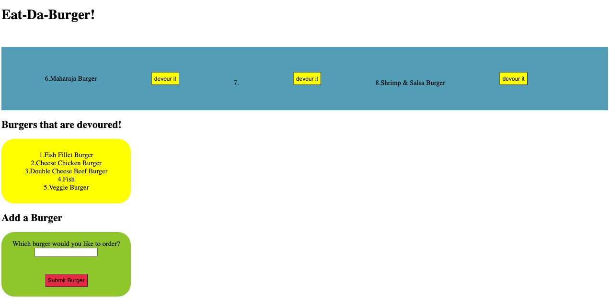

# Burger Drama- What does the project do?

This is a system that is intended to be used by a burger company where they are required to list all the burgers in their menu in addition to devour each of them separately still showing up in the devoured list.

### Links to the project

* GitHub Repo:
(https://github.com/sosingh1226/burger_drama)

* Deployed Heroku Link: 
(https://burger-drama.herokuapp.com/)

* Portfolio Link: 
(https://sosingh1226.github.io/portfolio_atwork/portfolio.html)

## Challenges

Using MySQL for various functions, connecting database and developing a connection between back end and front end.

